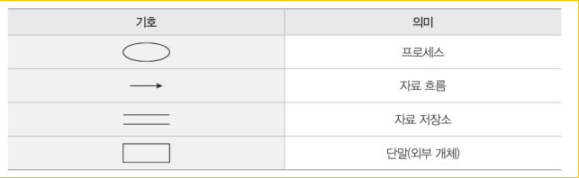
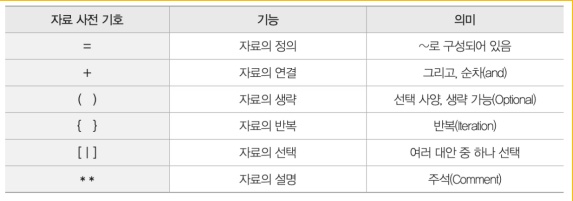

2강 - 요구사항 확인 + 분석기법

기능적 요구사항
뭘 하는지
- 입출금 하기
- 잔액 조회
- 이체하기

비기능적 요구사항
얼마나 잘하는지
- 3초 응답시간
- 보안 기능
- 가동률 99%

도분명검 - 요구사항 확인 4단계
1. 도출 - 요구사항 찾기
2. 분석 - 요구사항 분석하기
3. 명세 - 문서화하기
4. 검증 - 확인하기

요구 도출 방법들
- 인터뷰
- 설문조사
- 워크샵
- 브레인스토밍
- 프로토타이핑 (시제품 제작)
- 유스케이스 (사용 사례 분석)
- JAD (개발자와 사용자가 함께 작업)

구조적 분석 - 기능 중심 접근
- 시스템을 기능 중심으로 분석 (기능 단위 분해)
- 하향식 접근법 사용 (큰 기능 -> 작은 기능 세분화)
- 자료 흐름도(DFD) 활용 (데이터의 흐름을 시각적으로 표현)

자료 흐름도 (DFD) 구성요소

!자료 사전 기호

---

구조적 vs 객체지향 분석

구조적 분석
- 기능 중심
- 주문 -> 결제 -> 배송
- 뭘 하는지 중점

전환
- 분석 패러다임의 변화

객체지향 분석
- 데이터 + 행위 묶음
- 고객, 음식점, 주문 객체
- 누가 뭘 하는지 중점

럼바우의 OMT(Object Modeling Technique) 기법
- 객체지향 분석/설계 방법론

### 🔑 OMT 세 가지 주요 모델
* 객체 모델링 (뭐가 있나?)
* -> 동적 모델링 (어떻게 변하나?)
* -> 기능 모델링 (뭘 하나?)
- 객동기

| 모델 유형                      | 설명                                        | 비유                                            |
| -------------------------- | ----------------------------------------- | --------------------------------------------- |
| 1. 객체 모델(Object Model)     | 시스템을 구성하는 객체와 그들 간의 **관계, 속성, 연관성** 등을 정리 | **백화점의 부서와 직원들의 명함첩** (누가 있는지, 서로 어떤 관계인지) |
| 2. 동적 모델(Dynamic Model)    | 객체들의 \*\*상태 변화와 이벤트에 따른 반응(행위)\*\*를 표현    | **직원이 언제 어떤 행동을 하는지 시간 흐름에 따라 관찰**            |
| 3. 기능 모델(Functional Model) | **데이터 흐름과 처리 기능**을 표현 (DFD 기반)            | **고객이 주문 → 시스템이 처리 → 결과를 출력**                 |

다른 객체지향 분석 방법들
- Booch OOAD (설계 중심, 문서화 강조)
- Coad/Yourdon (E-R 다이어그램 사용)
- 통합 방법론 (UML로 발전)

### 기출문제
1. 비기능적 요구에서 시스템 구축에 대한
성능, 보안, 품질, 안정 등에 대한 요구사항을 도출함.

---

## ✅ 4번 각 선택지 분석

| 번호 | 보기               | 요구사항 분석과 관련성 | 설명                                    |
| -- | ---------------- | ------------ | ------------------------------------- |
| ①  | 비용과 일정에 대한 제약 설정 | 관련 있음 ✅      | 요구사항을 파악하면서 현실적인 비용과 일정 제약도 함께 고려해야 함 |
| ②  | 타당성 조사           | 관련 있음 ✅      | 요구사항이 실현 가능한지를 판단하는 **기초 조사** 단계      |
| ③  | 요구사항 정의 문서화      | 관련 있음 ✅      | 요구사항 분석의 **핵심 산출물**                   |
| ④  | 설계 명세서 작성        | 관련 없음 ❌      | **요구사항 분석 이후**, 설계 단계에서 수행            |

---

## 🧠 요약

| 구분        | 설명                                         |
| --------- | ------------------------------------------ |
| 요구사항 분석   | 고객이 원하는 기능, 조건, 제약 등을 **수집, 분석, 문서화**하는 단계 |
| 설계 명세서 작성 | 요구사항 분석 후 → **소프트웨어 아키텍처나 상세 설계**를 기술하는 단계 |

---

📌 **따라서, 정답은 ④ 설계 명세서 작성**

---

5. 사용 사례 분석 – 시스템의 외부에서 보는 기능 파악 – 요구에 대
   한 빠른 피드백

---

6. DFD는 "어떻게 데이터가 시스템을 통해 흐르는지"를 시각적으로 표현한 도구
- 구성 요소 `Process`, `Data Flow`, `Data Store`, `Terminator`(외부 엔티티)

