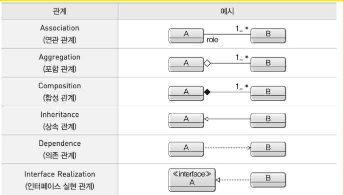

3강 - UML, 애자일

UML: 개발자들의 공통 언어
- 모든 개발자가 이해할 수 있는 공통 언어

UML의 3가지 핵심 구성요소
- Things 사물
- Relationships 관계
- Diagrams 다이어그램

구조적(정적) 다이어그램
- 클래스
- 객체
- 컴포넌트
- 배치
- 패키지

행위(동적) 다이어그램
- 유스케이스
- 시퀀스
- 상태
- 활동
- 통신

클객컴배패
유시상활통

유스케이스 다이어그램 - 고객 관점의 기능
주요 구성요소
1. 액터(사용자)
2. 유스케이스(기능)
3. 관계(화살표)

유스케이스 관계
- 연관 관계
- 포함 관계 (필수적)
- 확장 관계 (예외 사항, 부가적 기능)
- 일반화 관계 (상속 관계)

클래스 다이어그램
클래스 구조
- 클래스명
- 속성
- 메서드

접근 제한자
- + public (모두 접근 가능)
- # protected (같은 패키지 + 다른 패키지의 자식)
- ~ default (같은 패키지)
- - private (같은 클래스)

클래스 관계

Association (연관 관계)
- 실선으로 연결
- 서로 알고 지낸다
- 학교-학생, 학생-강의(1 - N)

Aggregation (포함 관계)
- 비어있는 마름모(◇)
- 같이 있긴 한데 없어도 됨
- 팀과 선수, 선수는 팀이 없어도 된다.
- Team ◇------------- Player

Composition (합성 관계)
- 채워진 마름모(◆)
- 운명을 같이 함
- Building ◆------------- Room

Inheritance (상속 관계)
- 동물 <- 오리

Dependence (의존 관계)
- 점선 + 화살표
- 1회용 관계
- OrderService ---> OrderRepository
- 택시 타는 손님. 잠깐 만났다 헤어짐.
- 스프링에서 DI 했던거 기억하기

Interface Realization (인터페이스 실현 관계)
- 요리레시피 <---- 짜장면

---

시퀀스 다이어그램 - 시간의 흐름 표현
- 시간 흐름에 따른 객체 상호작용
- 객체 간 메시지 교환(메서드 이용)을 순서대로 보여줌
- 수직 방향은 시간의 흐름을 나타냄

시퀀스 다이어그램 구성요소
- 액터
- 객체
- 생명선
- 실행 (객체가 활성화된 기간)
- 메시지

---

상태 다이어그램 - 객체의 상태 변화
- 대기, 인증, 거래, 종료
- 상태 간 전환은 이벤트와 조건에 의해 발생

| 요소             | 설명                          | UML 기호   |
| -------------- | --------------------------- | -------- |
| 상태(State)      | 객체의 현재 상태                   | 둥근 사각형   |
| 시작 상태(Start)   | 처음 시작되는 지점                  | ● (검은 점) |
| 종료 상태(End)     | 흐름이 끝나는 지점                  | ● 안에 ●   |
| 전이(Transition) | 상태 간 이동 (이벤트 or 조건에 의해 전환됨) | → (화살표)  |

---

활동 다이어그램 - 업무 흐름 표현

---

애자일 vs 전통적 개발

전통적 개발
- 6개월 완벽 계획
- 모든 요구사항 사전 정의
- 전체 설계 후 개발 시작
- 한 번에 완성품 출시
- 변경 어려움

애자일 개발
- 2주 단위 빠른 개선
- 핵심 기능부터 개발
- 빠른 피드백 반영
- 지속적인 개선
- 변화에 유연하게 대응

> 빠르게 만들고, 피드백 받고, 개선하는 방식

---

애자일의 4가지 가치
1. 프로세스보다 사람
2. 문서보다 소프트웨어
3. 계약보다 협력
4. 계획보다 변화 대응
프문계계

XP - 애자일의 대표주자(켄트 벡)
1. 존중
2. 단순성
3. 의사소통
4. 피드백
5. 용기
존단의피용

---

스크럼 - 30일 스프린트의 마법
1. 스프린트 계획
2. 개발
3. 리뷰
4. 회고

기타 애자일 방법론들
FDD - Feature 마다 2주 반복 개발
Lean - 낭비 제거에 초점

